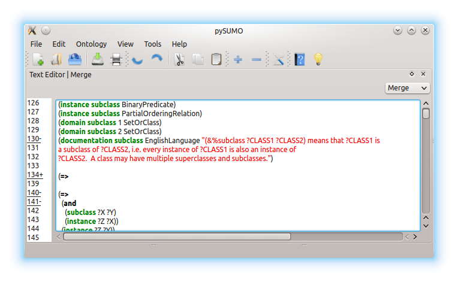
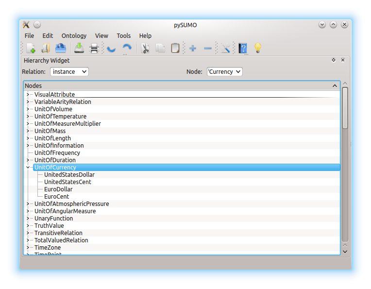
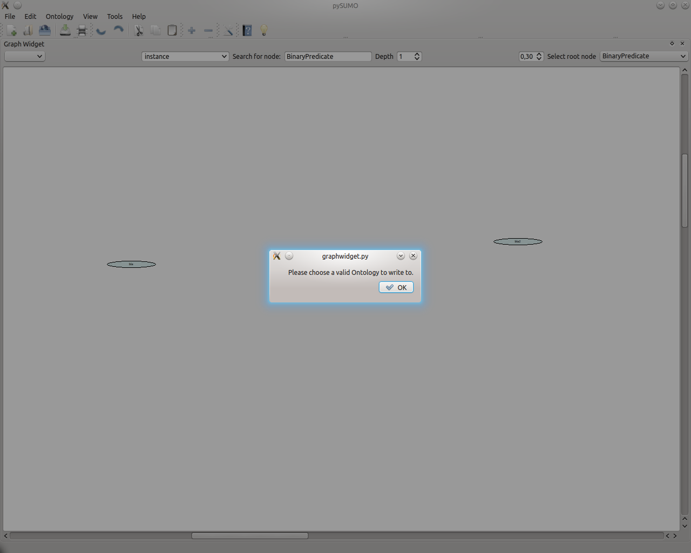
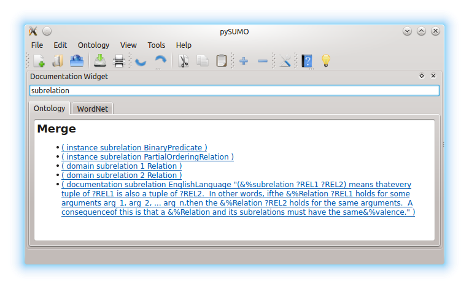

Library
=====
ActionLog
---------
* Queue the addition of an ontology to the A0ctionLog * Initialize an ActionLog with an ontology * Modify an ontology and store the changes * Assert that undoing the last action returns the previous state * Assert that undo/redo is invariant * Make sure the queue auto-flushes when exceeding size * Check that addition queue is overwritten when new changes are added and the old changes have not been OK'd. * Assert the invariance of excessive undoes * Assert the invariance of excessive redoes
* Check that ActionLog copes with high workloads

IndexAbstractor
---------------
* Assert than normalize() normalizes terms correctly.
* Assert that the index is built correctly.
* Test search on various terms
* Test WordNet search and self-initialization.
* Build several AbstractGraphs and check their contents
* Test that get_ontology_file returns the correct kif
* Test that adding multiple ontologies works
* Test that get_completions returns a correct list of terms

Parser
------
wParse
^^^^^^
* Check that Tokenizer works on single lines
* Check that whole WordNet parses successfully

kifParse
^^^^^^^^
* Check invariance of kifparse/kifserialize
* Test that parsing Government.kif works

SyntaxController
----------------
* Assert that add_ontology() adds an AST equivalent to the one produced by kifparse()
* Assert the invariance of redundant adds
* Assert that adding and then deleting an ontology is invariant
* Check that adding two ontologies works correctly
* Assert that get_ontologies() lists the correct ontologies
* Assert that modifying the ontology  works correctly
* Assert that parsing diffs works correctly
* Assert that undo/redo work correctl

WordNet
-------
* Check functionality of locate_term
* Check functionality of find_synonym

GUI
==============

Text Editor
--------------------

  
  Texteditor after doing test.
  
..

   1. Open pySUMO
   2. Open TextEditor
   3. Open Merge.kif
   4. Choose Merge.kif
   5. Collapse Line 288
   6. Collapse Line 136
   7. Collapse Line 134
   8. Uncollapse Line 134
   9. Uncollapse Line 288
   10. Collapse all
   11. Expand all

Graphical Settings
-----------------------
  1. Open pySUMO
  2. Open TextEditor
  3. Open Merge.kif
  4. Choose Merge.kif
  5. Open GraphWidget
  6. Open DocumentationWidget
  7. Open Hierarchy Widget
  8. Open TextEdiorWidget

Hierarchy Widget
----------------------

  
  Hierarchywidget after doing test.
  
..
  1. Open pySUMO
  2. Open HierarchyWidget
  3. Open Merge.kif
  4. Type instance into the Relation field
  5. Press Enter
  6. Type unitofcurrency into the Node field
  7. Press Enter
  8. Type subrelation into the Relation field
  9. Press Enter
  10. Collapse all
  11. Expand all

Graph Widget
----------------------

.. figure:: graphwidget1.png
  :width: 75 %
  :alt: Graphwidget during test
  
  Graphwidget after step 6.
  
..

  
  Graphwidget after step 11.
  
..

  1. Open pySUMO
  2. Open GraphWidget
  3. Open Merge.kif
  4. Select instance on Variant selector
  5. Select a root node
  6. Select a depth (1)
  7. Open a new ontology to write temporary content to.
  8. Add a node "bla" in Graph Widget
  9. Add a node "bla2"
  10. Add a node "bla" (error)
  11. Add a relation instance between "bla" and "bla2" (error)
  12. Change scale
  13. Choose a valid selector (there was a messagebox)
  14. Add a relation instance between "bla" and "bla2"
  15. Undo
  16. Redo

Documentation Widget
-----------------------

  
  Documentation widget after step 6.
  
..

.. figure:: docwidget2.png
  :width: 75 %
  :alt: Docwidget after doing test
  
  Docwidget after doing test.
  
..

1. Open pySUMO
2. Open Merge.kif
3. Open DocumentationWidget
4. Switch to the Ontology tab in the DocumentationWidget
5. Type subrelation into the search field
6. Press Enter
7. Open TextEditor
8. Select Merge.kif in TextEditor
9. Press one of the links listed under "Merge"
10. Switch to the WordNet tab in the DocumentationWidget
11. Search for 'Object'
12. Search for 'Table'

MainWindow
-------------------------------
.. figure:: mainwindow1.png
  :width: 75 %
  :alt: Possible output when using widgets
  
  Widgets ordering.
  
..

#. Open pySUMO
#. Open a new Ontology named "Mondial"
#. Open a remote ontology named "Mondial" at location: http://sigmakee.cvs.sourceforge.net/viewvc/sigmakee/KBs/mondial.kif
#. Close the ontology named "Mondial" with save and reopen it as local file.
#. Add Text Editor Widget
#. Add Documentation Widget
#. Add Graph Widget
#. Add Hierarchy Widget
#. Reorder Widgets
#. Make a print preview of the ontology "Mondial" from the Text Editor Widget
#. Delete the Text Editor Widget
#. Make a print preview of the ontology "Mondial" from the Graph Widget
#. Add a node and a relation in Graph widget
#. Delete the Graph Widget
#. Try to update the ontology "Mondial"
#. Open ontology properties dialog for "Mondial" and then close it.
#. Open Option Dialog and then close it
#. Revert the ontology "Mondial"
#. Quit pySUMO

